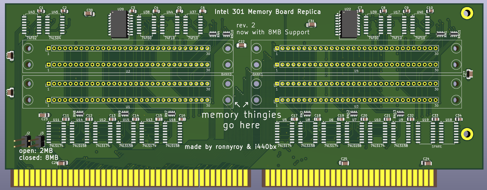

# 386 memory board by ronnyroy

This is an attempt to reproduce and improve the 32 bit memory expansion cards of the Intel 301 386 mainboard https://theretroweb.com/motherboards/s/intel-301-system-board-pba-451213-xxx based off my original 2MB card.  
Instead of 41256 DIP DRAM chips it uses 30pin SIMM modules, all SMD parts and can also be adapted to 8MB.  

Big thanks to i440bx who was working on reverse engineering his own card independently and helped greatly by finding the user manual for the board and an image of the 8MB card on https://www.vaxbarn.com/index.php?option=com_content&view=article&id=749.

# Initial Revision
The initial PCB revision has been tested and confirmed working.  
It was designed to test my clone of the 2MB card and for modding it to 8MB.

### Modding to 8MB
- CPUA21(pin85) on the slot to pin 5 of U9 and U16.  
- CPUA22(pin95) on the slot to pin 4 of U10 and U13.

# Second Revision
This adds the missing traces and jumpers required for 2/8MB operation and the slot cutout i excluded from rev.1.  

# Important!
An 8MB card configured to 2MB on the mainboard will start up fine and even pass an extended CheckIt memory test but running programs that use the memory of the card crash.  
So the card needs to be configured matching to the mainboard.
