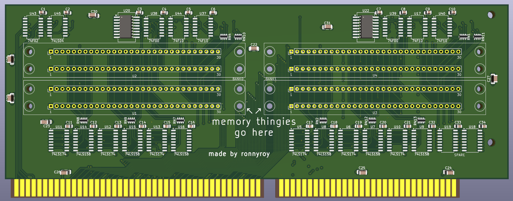

# 386 memory board by ronnyroy

This is an attempt to reproduce the 32 bit memory expansion card of the Intel 301 386 mainboard https://theretroweb.com/motherboards/s/intel-301-system-board-pba-451213-xxx based off my original 2MB card.
Instead of 41256 DIP DRAM chips it uses 30pin SIMM modules and all SMD parts.
It is designed to be easily modified to 8MB with minimal PCB changes once the missing address lines needed for the additional capacity are figured out.

# Initial Revision
The initial PSB revision has been tested and confirmed working
Some minor issues have been noted and will be fixed if i make another revision

# Assembly Notes:
the optimal order for assembly is capacitors, resistor arrays, chips and the simm's at last
